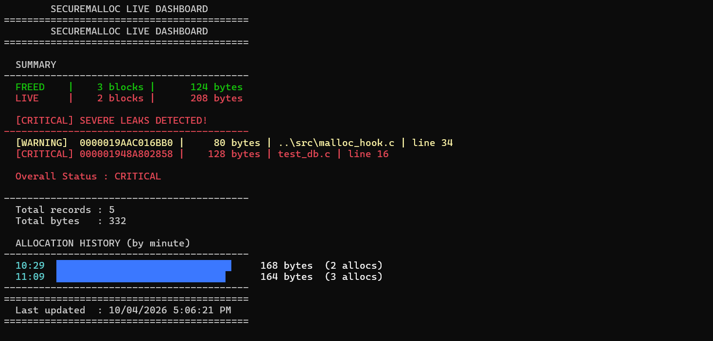
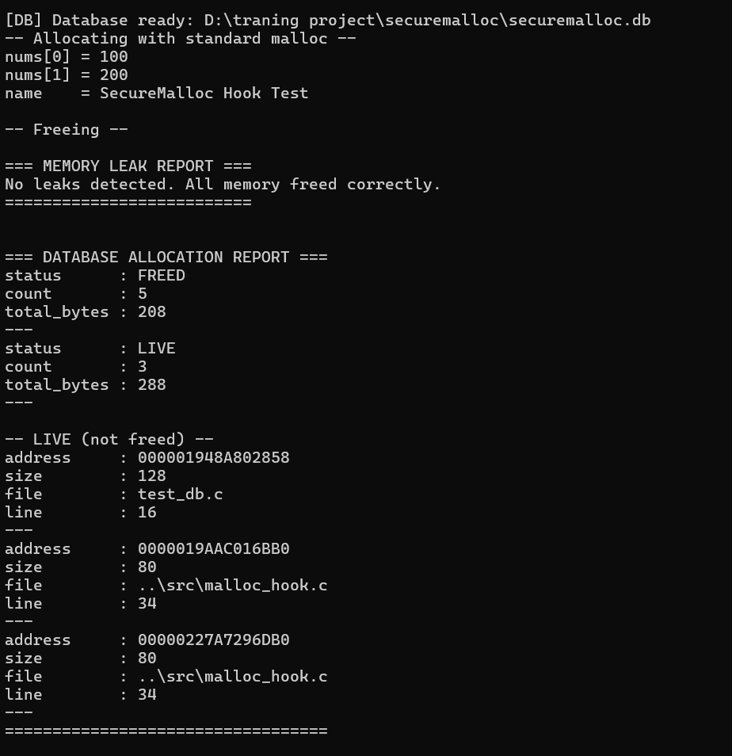
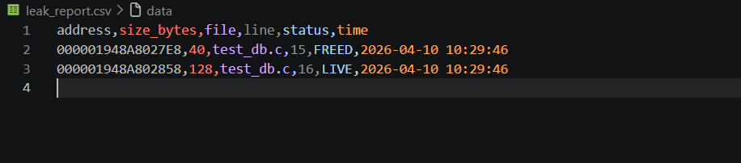

<div align="center">

# 🛡️ SecureMalloc

### Production-grade Secure Memory Allocator built from scratch

[](https://github.com/harshadulshan/securemalloc)
[](https://github.com/harshadulshan/securemalloc)
[](https://github.com/harshadulshan/securemalloc)
[](https://github.com/harshadulshan/securemalloc)
[](https://github.com/harshadulshan/securemalloc)

**A memory allocator that detects heap exploits, buffer overflows,**
**use-after-free, and memory leaks — in real time.**

*Think: a lightweight version of what Google's tcmalloc + Valgrind +*
*AddressSanitizer do — but built from scratch.*

[View Demo](#-live-dashboard) · [Features](#-security-features) · [Quick Start](#-quick-start) · [Contact](#-contact)

</div>

---

## 📸 Screenshots

<div align="center">

| Live Dashboard | Security Detections | CSV Export |
|:-:|:-:|:-:|
|  |  |  |
| *Real-time allocation monitor* | *Exploit detection output* | *Allocation history export* |

</div>


/* Standard code — fully protected automatically */
int* data = (int*)malloc(sizeof(int) * 10);
free(data);
free(data); /* SecureMalloc catches this! */


<div align="center">

# 🛡️ SecureMalloc

### Production-grade Secure Memory Allocator built from scratch

[](https://github.com/harshadulshan/securemalloc)
[](https://github.com/harshadulshan/securemalloc)
[](https://github.com/harshadulshan/securemalloc)
[](https://github.com/harshadulshan/securemalloc)
[](https://github.com/harshadulshan/securemalloc)

**A memory allocator that detects heap exploits, buffer overflows,**
**use-after-free, and memory leaks — in real time.**

*Think: a lightweight version of what Google's tcmalloc + Valgrind +*
*AddressSanitizer do — but built from scratch.*

[View Demo](#-live-dashboard) · [Features](#-security-features) · [Quick Start](#-quick-start) · [Contact](#-contact)

</div>

---

## 📸 Screenshots

<div align="center">

| Live Dashboard | Security Detections | CSV Export |
|:-:|:-:|:-:|
|  |  |  |
| *Real-time allocation monitor* | *Exploit detection output* | *Allocation history export* |

</div>

---

## ⚡ What Is This?

SecureMalloc **replaces** the standard `malloc` and `free` with a
security-hardened allocator. Any C program compiled with it is
automatically protected — zero code changes needed.

## 📁 Project Structure
securemalloc/
├── 📁 include/
│   └── securemalloc.h          # Core API and data structures
├── 📁 src/
│   ├── securemalloc.c          # Allocator + security engine
│   ├── malloc_hook.c           # malloc/free/calloc/realloc override
│   ├── db_logger.h             # Database logger header
│   └── db_logger.c             # SQLite allocation logger
├── 📁 tests/
│   ├── test_alloc.c            # Allocator + security tests
│   ├── test_db.c               # Database logger tests
│   └── test_hook.c             # Malloc hook tests
├── 📁 SecureMalloc.Dashboard/  # C# live dashboard
│   └── Program.cs
├── 📁 docs/                    # Screenshots
├── README.md
└── README.html     

---

## 🚀 Quick Start

### Requirements
- GCC 15+ (MinGW-w64 for Windows)
- .NET 10 SDK
- SQLite amalgamation (sqlite3.h + sqlite3.c)

### Build and Run

**1 — Core allocator tests:**
```bash
cd tests
gcc test_alloc.c ..\src\securemalloc.c -o test_alloc.exe -I..\include
.\test_alloc.exe
```

**2 — Database logger:**
```bash
gcc test_db.c ..\src\securemalloc.c ..\src\db_logger.c ..\src\sqlite3.c -o test_db.exe -I..\include -I..\src
.\test_db.exe
```

**3 — Malloc hook (protect any program):**
```bash
gcc test_hook.c ..\src\securemalloc.c ..\src\malloc_hook.c ..\src\db_logger.c ..\src\sqlite3.c -o test_hook.exe -I..\include -I..\src
.\test_hook.exe
```

**4 — Live dashboard:**
```bash
cd SecureMalloc.Dashboard
dotnet run
```

---

## 📊 Algorithms Used

| Algorithm | Purpose | Complexity | Layer |
|-----------|---------|------------|-------|
| Canary Generation | Buffer overflow detection | O(1) | Security |
| Poison Patterns | Use-after-free detection | O(n) | Security |
| Doubly Linked List | Heap block tracking | O(1) insert | Allocator |
| Hash Table | Allocation record lookup | O(1) avg | Profiler |
| SQLite B-Tree | Persistent history | O(log n) | Database |
| Ring Buffer | Event logging | O(1) | Profiler |

---

## 🧰 Tech Stack

| Layer | Technology | Purpose |
|-------|-----------|---------|
| Core Allocator | C (GCC 15) | Memory management engine |
| Security Engine | C | Exploit detection |
| Profiler | C + SQLite | Allocation tracking |
| Dashboard | C# .NET 10 | Live visualization |
| Database | SQLite | Persistent history |
| Version Control | Git + GitHub | Source management |

---

## 💡 Why This Project?

Most developers never touch:
- ❌ Raw memory management internals
- ❌ Security exploit detection at allocator level
- ❌ System call interception
- ❌ Heap internals

This project shows deep understanding of:
- ✅ How memory **actually** works
- ✅ How exploits **actually** happen
- ✅ How to **prevent** them at allocator level
- ✅ Cross-language system integration

---

## 📈 Dashboard Features

- ✅ Live allocation summary with color coding
- ✅ Critical vs Warning severity levels
- ✅ ASCII allocation graph over time
- ✅ Auto refresh every 5 seconds
- ✅ CSV export of full allocation history
- ✅ SQLite persistent history

---

## 📬 Contact

<div align="center">

**Harsha Dulshan Kaldera**

[](mailto:harshakaldera540@gmail.com)
[](https://www.linkedin.com/in/harsha-kaldera/)
[](https://github.com/harshadulshan)

</div>

---

<div align="center">

**⭐ If this project helped you, please give it a star!**

*Built with ❤️ by Harsha Dulshan Kaldera*

*SecureMalloc is open source — feel free to use, learn from, and contribute*

</div>
